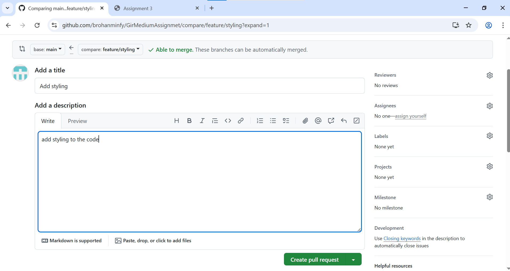
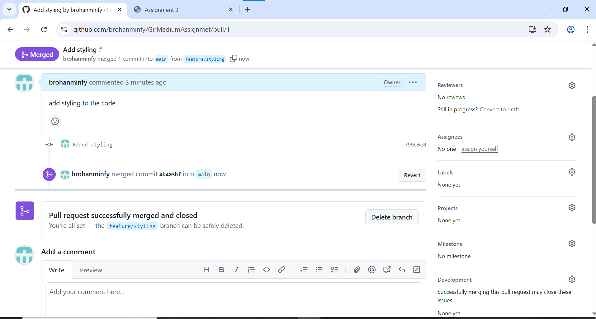
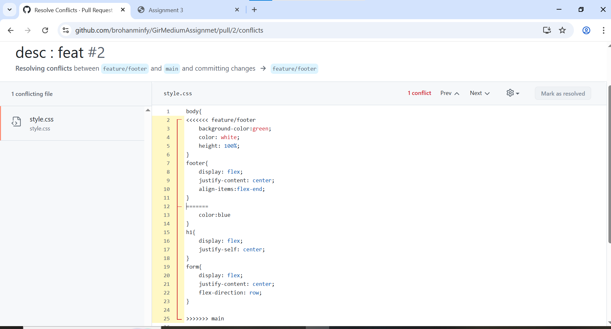

# GirMediumAssignmet
<h1>Assignment 3: Branching Strategies &amp; Merge Conflicts </h1>

<h3>Feature 1 Pull Request</h3>

<h3>Feature 1 Creation of Pull Request</h3>

<h3>Feature 1 Creation of Merge Request</h3>

<h3>Feature 1 is Merged</h3>

<h3>Feature 2 Merging</h3>

<h3>Feature 2 Merge Conflict</h3>

<h3>Resolving Merge Conflict</h3>

<h3> Merge Conflict Resolved</h3>

<h3>Final Merging after Resolved</h3>

